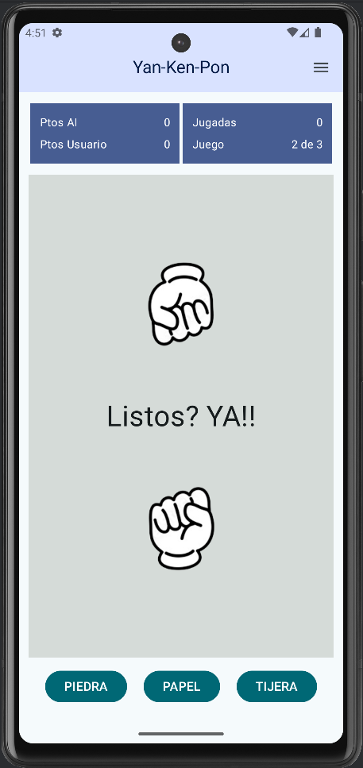
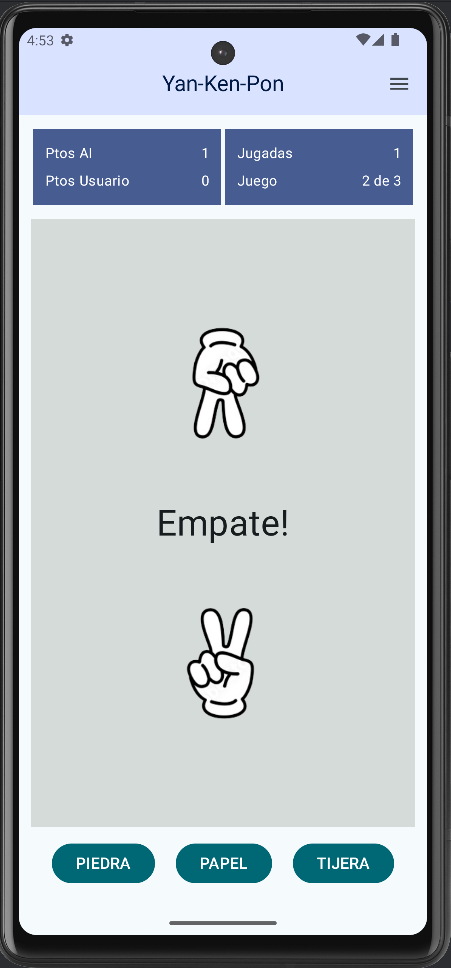
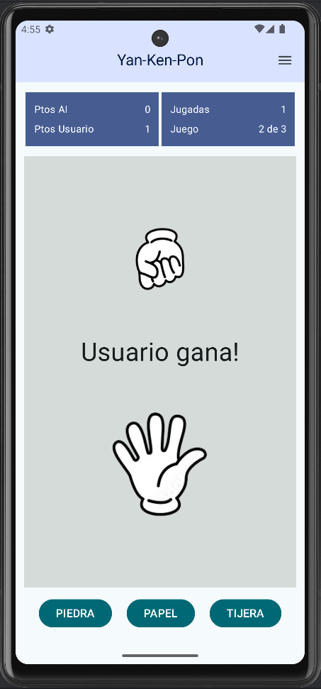
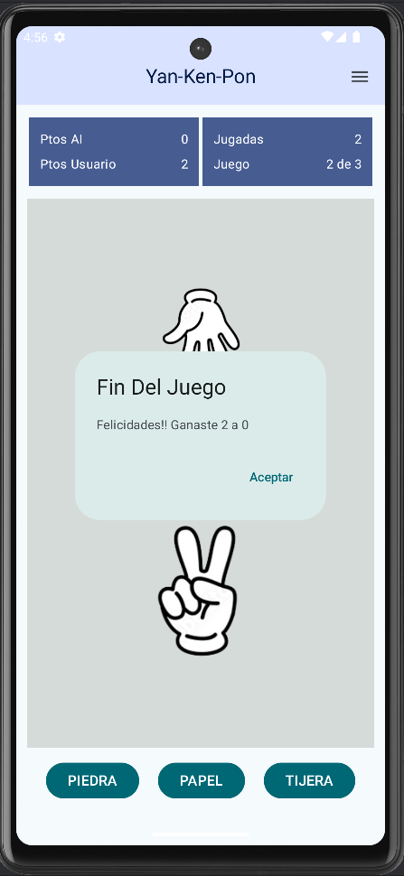

# PROYECTO JUEGO - PIEDRA PAPEL TIJERA

Esta app interactiva para Android llamada Piedra Papel Tijera o Jan-Ken-Pon aunque parezca un juego sencillo, su creación requiere muchos conocimientos, permite a los usuarios jugar contra la máquina en tres modalidades de juego, el mejor de 3, el mejor de 5 y el mejor de 10.

> [!IMPORTANT]
> Si te interesa aprender cómo realizar alguna de estas funcionalidades de la aplicación, brindamos pequeños cursos de manera virtual y personalizada. O si deseas ayuda de un Desarrollador Junior o Senior **garantizado** para alguna aplicación que tienes en mente, puedes contactarnos por Whatsapp al [wa.me/59170616269](https://wa.me/59170616269).

## CONOCIMIENTOS APLICADOS

- Creación y ejecución de una app básica de Compose en Android Studio.
- Uso de elementos componibles en una app.
- Extracción de texto y conversión a recursos de strings para facilitar la comunicación de la app y reutilizar los strings.
- Conceptos básicos de programación de Kotlin.
- Uso de elementos más complejos que manejan funciones lambda en una app para Android con Compose.
- Agregar eventos en la UI para agregar comportamiento interactivo en la app para Android con Compose.

## VIDEO DEL JUEGO EN ACCIÓN

## PANTALLAS DEL PROYECTO

  

## APLICACIÓN DESCARGABLE

Este repositorio cuenta con el instalador APK de la aplicación, para fines de prueba en un dispositivo físico o virtual en un equipo, como sugerencia de un dispositivo virtual de mejor rendimiento que el emulador de Android Studio, se puede usar BlueStacks. El archivo APK de ésta aplicación se encuentra en el directorio principal del proyecto, junto a MainActivity.kt.

> [!WARNING]
> Este repositorio tiene como única finalidad mostrar un portafolio de proyectos realizados, para mostrar la experiencia y conocimiento en el desarrollo de aplicaciones móviles con Android Studio, conocimientos de Kotlin y el kit de herramientas UI Jetpack Compose.
> 
> Este repositorio no cuenta con todos los archivos de código de la aplicación para clonar y hacer pruebas o modificaciones. Si tiene interés en acceder al código de desarrollo de la aplicación o pertenecer a una comunidad exclusiva de Desarrolladores Android para tener acceso al código de cientos de aplicaciones de prueba desarrolladas, puede contactarse con nosotros por Whatsapp al [wa.me/59170616269](https://wa.me/59170616269).

### Te agradeceríamos que nos ayudes con una ⭐ para seguir creciendo en la comunidad de GitHub.
